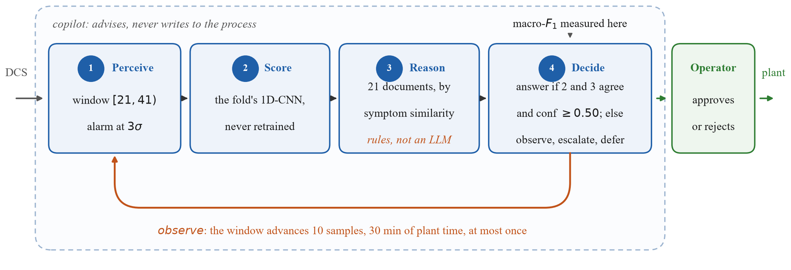
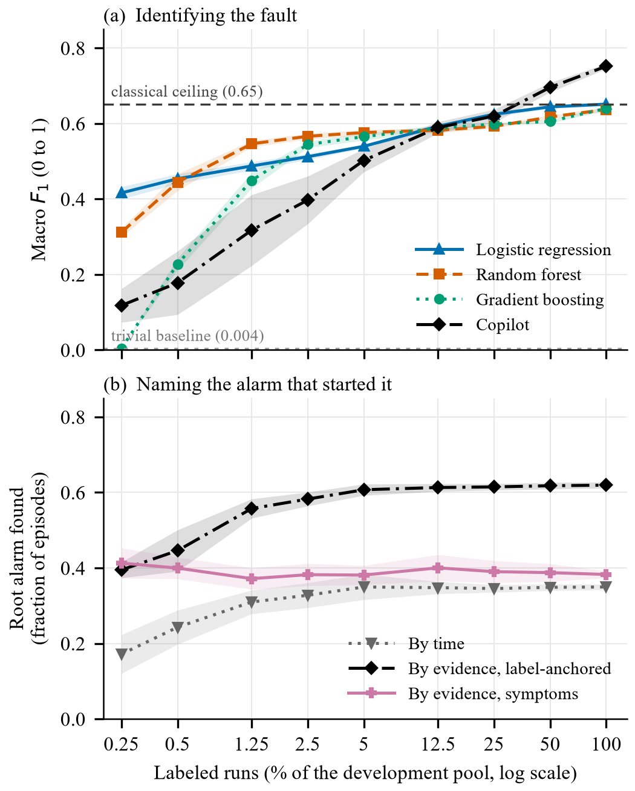

# An Agentic AI Copilot for Operator Decision Support

**Mario Elvir, Josué Rivera, Christian Barahona, Luis Loo (PhD(c), advisor)**,
Maestría en Automatización Industrial, UTH Honduras
*Manuscript in preparation*

`github.com/MarioElvir-UTH/tep-rootcause-copilot` - the address the paper cites,
and where the continuous integration this README appeals to actually runs.

> During an alarm flood, can a copilot tell a DCS operator which alarm started
> the upset and which fault caused it, from few labels, and show its work?

The copilot perceives an alarm episode, scores it with a convolutional network,
retrieves the documents its symptoms match, and decides on one action: answer,
look longer, escalate, or hand the episode to the operator. It never writes to
the plant. Everything below is measured on the public Tennessee Eastman Process
under one pre-registered protocol, on validation folds, with the test set sealed.

<p align="center">
  
</p>

<p align="center"><sub>Drawn by <code>code/13_plot_architecture.py</code> from
<code>results/agente_env.json</code>, so every constant in it is one the agent
actually ran with. The operator is outside the dashed boundary on purpose: that
is the guard, not a promise.</sub></p>

This is deliberately the **smallest version that produces a number**, not the
full system: the reasoning step is rules, the corpus is one document per class,
and the agent looks ahead once. What that leaves out is named as future work in
the paper, with a reason for each, rather than left for a reviewer to notice.

<p align="center">
  
</p>

## What we found

- **Naming the alarm that started it is where retrieval pays.** Ordering alarms
  by retrieved evidence identifies the root alarm in 0.619 of the episodes whose
  cause the source documents, against 0.349 by time alone: a paired gain of
  +0.270 ± 0.001 with d = 33.6, and it does not touch the classifier.
- **The explanation needs far fewer labels than the number does.** It reaches
  94% of its full-supervision value with 2.5% of the labels, where the
  classifier is still at 53% of its own. A plant can say which alarm started an
  upset long before it can say reliably which fault it was.
- **The loop is worth more than the retrieval.** Letting the agent advance the
  window and look again gains +0.056 ± 0.001 macro-F1 (d = 7.0) over scoring the
  same network once.
- **And retrieval costs 0.011 on the primary metric, which we report rather than
  bury.** The proposed method reaches 0.741 ± 0.008 against 0.752 ± 0.009 for its
  own ablation. What it buys is not accuracy but independence: classifier and
  retrieval agree on 42.7% of episodes and are then right 94.0% of the time,
  against 60.4% when they disagree, so the copilot can tell the operator when
  to distrust it.
- **The price is coverage.** Requiring the two to agree hands 59% of episodes
  to the operator against 26% for the ablation.

## Verifying this yourself, without trusting us

Three claims carry the paper, and each can be checked from a clone:

- **The split is frozen.** Delete `splits/`, run `python code/02_make_partition.py`,
  and the manifest must hash to `4cf7e020b0f2faa6`. Continuous integration does exactly this on
  every push, on Linux.
- **No number in the paper was typed by hand.** `python code/resultados.py --check`
  regenerates Table II, the results paragraph and this README's expected-results
  table from `results/tabla2.json` and fails if any of them drifted.
- **The agent is rules, not a language model.** `results/agente_env.json` records
  `razona: rules (symptom retrieval); prompts/razona.txt is NOT executed`, and
  the decision log in `results/logs/` shows the four actions with their guards.
  That is why the cost column reports zero tokens.

---

## Reproducible baseline: the graded core

Everything here is produced by code in this repository. **What does not run does
not count.** After placing the data (Section 2), a fresh clone reproduces the
baseline with a single command:

```bash
python code/run_all.py
```

The reproducible baseline is four checkable pieces, each traceable to a script and
a number:

| Requirement | Where in the repo | Reproduced by | Number |
|---|---|---|---|
| Script that **loads and describes** the data | `01_explore_data.py` | step 1 of `run_all.py` | schema, 21 classes, quality checks |
| **Frozen partition**, committed to the repo | `splits/partition_manifest.csv`, `splits/partition_meta.json` | `02_make_partition.py` (seed 42) | sha256 `4cf7e020b0f2faa6` |
| **Trivial** baseline, with its number | `results/classics_cv_comparison.csv` | `03_baselines.py`, `04_classics_cv.py` | F1-macro **0.004 ± 0.000** |
| **Simple model**, with its number | `results/classics_cv_comparison.csv` | `04_classics_cv.py` | Logistic regression **0.652 ± 0.005**; Random forest **0.638 ± 0.005**; Gradient boosting **0.640 ± 0.005** (F1-macro) |

Baseline only, skipping the auxiliary domain-feature analyses (about 16 min): run
`02_make_partition.py`, `03_baselines.py`, `04_classics_cv.py`, `10_inference_time.py`
in that order (see the [Fast path](#3-reproduce) below).

---

## What this reproduces

- **Table II**: trivial floor, three classical baselines, two networks (MLP, 1D-CNN),
  and the copilot agent with its ablation
  (F1-macro primary; Recall@1/Recall@3/MRR secondary; per-episode inference latency as cost).
- **The agent measurements**: root-alarm identification with and without knowledge,
  the decomposed grounding rubric over three arms, and the action distribution
  (`results/agente_comparison.csv`, `results/logs/decisiones_muestra.jsonl`).
- **Table II itself**: `results/tabla2.json` holds every number of the table, one row
  per model, with the primary and secondary metric given per seed rather than already
  averaged. `resultados.py` turns that file into the LaTeX table and splices it into
  the manuscript, so no value in Table II is ever typed by hand; `python
  code/resultados.py --check` compares the two and fails if they have drifted apart.
- **The cost column of Table II**: size, training seconds and inference milliseconds
  for all eight rows, measured in one run so they are comparable
  (`results/cost_table.csv`). Size counts what each model stores to make a decision;
  the two timings are wall-clock and move with machine load.
- **How every comparison in the paper is settled**: the macro-F1 of all nine models
  on each of the 15 folds (`results/per_fold_f1.csv`), and for each pair the paired
  difference averaged by seed, Cohen's d, and whether the mean ± std intervals
  overlap (`results/effect_sizes.csv`). Differences are taken fold by fold, never by
  subtracting two separate means, and no result is called statistically significant:
  three seeds do not support that claim.

- **The main figure, in two panels**: macro-F1 against the fraction of labels used, and
  root-alarm identification on the same budgets, with everything retrained at each
  budget (`results/label_efficiency_curve.{csv,pdf,png}`,
  `results/label_efficiency_agent.csv`). The two panels answer different questions:
  the rubric saturates with 2.5% of the labels, where the classifier is still at 53%
  of its own ceiling.
- **The architecture figure**: drawn by `13_plot_architecture.py` from
  `results/agente_env.json`, so the diagram cannot drift away from the constants
  the agent actually ran with (`results/architecture_loop.{pdf,png}`).
- A **cross-validation leakage audit** (4 checks) confirming the protocol is honest.

Not reproduced by the command, and deliberately so: `results/samples/` holds a
qualitative sample of what the copilot would say to an operator, one episode per
action, chosen by a rule declared in advance and drafted outside the pipeline from
the decision log. Those texts **produce no reported number**. See
`results/samples/README.md`, which also records the two places where the declared
rule gave an awkward answer and it was reported rather than adjusted.

**Task definition (deliberately harder than typical TEP benchmarks):** one label
per simulation run, an early **causal window `[21, 41)`** (decision made with data
available at the moment, never the future), and **21 root-cause classes**
(1 normal + 20 faults). This is why F1-macro ≈ 0.65 is expected and is *not*
comparable to the 90%+ figures reported by full-trajectory TEP studies: it buys
operational validity (latency measurable, real-time faithful).

---

## 1. Environment

Tested on **Python 3.14.2 (Windows 11)**. `requirements.txt` cannot pin the
interpreter itself, so use that version (or a virtual environment created from it):

```bash
python -m pip install -r requirements.txt
```

Core dependencies: `numpy`, `pandas`, `scikit-learn`, `pyreadr` (reads the `.RData`
files), `pyarrow` (parquet caches), `matplotlib` (figure). See `requirements.txt`
for exact pinned versions.

**PyTorch is a second install, and seven of the 23 steps need it.** It is not in
`requirements.txt` because the CPU build is served from PyTorch's own index
rather than from PyPI:

```bash
python -m pip install torch==2.14.0 --index-url https://download.pytorch.org/whl/cpu
```

`run_all.py` checks for it before running anything, so a missing install costs a
second rather than the hour it takes to reach the first step that imports it.

**Reference machine** for every runtime quoted in this README: Intel Core
i5-13420H (8 cores / 12 threads), 32 GB RAM, Windows 11, **CPU only, no GPU
required**. The scripts use all available cores (`N_JOBS = -1`), so wall-clock
times scale with core count. Results do not: the seeds fix every number.

## 2. Get the data (not stored in this repo)

The raw TEP simulation data is **not redistributed here**: it is large (~1.34 GB)
and publicly hosted at its canonical source. Download the four `.RData` files from:

> Rieth, C. A., Amsel, B. D., Tran, R., & Cook, M. B. (2017). *Additional
> Tennessee Eastman Process Simulation Data for Anomaly Detection Evaluation.*
> **Harvard Dataverse, V1.** DOI: [10.7910/DVN/6C3JR1](https://doi.org/10.7910/DVN/6C3JR1)

Place them exactly here (folder name `dataverse_files/`):

| File | Size | Role |
|---|--:|---|
| `TEP_FaultFree_Training.RData` | 24.7 MB | class 0, training pool |
| `TEP_Faulty_Training.RData`    | 494 MB  | classes 1-20, training pool |
| `TEP_FaultFree_Testing.RData`  | 47.3 MB | class 0, **test pool (sealed)** |
| `TEP_Faulty_Testing.RData`     | 837 MB  | classes 1-20, **test pool (sealed)** |

```
dataverse_files/
├── TEP_FaultFree_Training.RData
├── TEP_Faulty_Training.RData
├── TEP_FaultFree_Testing.RData
└── TEP_Faulty_Testing.RData
```

## 3. Reproduce

**Everything (one command, 12 CPU threads, no GPU):**

```bash
python code/run_all.py
```

Every push runs `.github/workflows/checks.yml`, which checks what a clone can
check without the 1.34 GB of raw data: that every script compiles, that the
pipeline finds all 23 of its steps, that the frozen partition rebuilds to the
same `4cf7e020b0f2faa6` the paper cites, and that the generated files still
match `results/tabla2.json`. The full pipeline needs the download in section 2.

Runs the 23 steps in dependency order, stops at the first failure, and lists the
result files produced. Re-running yields identical numbers (fixed seeds + the
frozen partition on disk). The **test set stays sealed throughout**: no
`*_Testing` file is opened for scoring.

Steps 1-10 were measured at about 80 min on the reference machine; steps 11 and
12 (network training over 15 folds and the agent over three arms) add to that.
Wall-clock is indicative and moves with processor and load.

**Fast path, just Table II (about 16 min on the reference machine):** run only
the core steps:

```bash
python code/02_make_partition.py   # freeze the by-run split (seed 42)
python code/03_baselines.py        # trivial + RF on the frozen split
python code/04_classics_cv.py      # logistic + RF + Gradient Boosting, grouped CV -> Table II
python code/10_inference_time.py   # training time + inference latency (Table II cost)
```

Add `08_label_efficiency.py` then `09_plot_label_efficiency.py` to regenerate the
figure (both need the feature cache built by step 04).

**Agent rows of Table II:** `11_train_dl.py` (needs PyTorch, writes one checkpoint
per fold to `results/models/`) then `12_agente_v1.py`, which reuses those
checkpoints and does not retrain.

## 4. Expected results (frozen)

`results/classics_cv_comparison.csv`, `results/dl_comparison.csv`,
`results/agente_comparison.csv` and `results/inference_time.csv` should match:

<!-- BEGIN esperados (generated by resultados.py; do not edit by hand) -->
| Model | F1-macro | Recall@3 | Size (numbers stored) |
|---|---|---|---|
| Trivial (majority) | 0.004 ± 0.000 | 0.143 ± 0.000 | 21 |
| Logistic regression | 0.652 ± 0.005 | 0.733 ± 0.003 | 2,205 |
| Random forest | 0.638 ± 0.005 | 0.703 ± 0.006 | 98,684 |
| Gradient boosting | 0.640 ± 0.005 | 0.654 ± 0.007 | 67,499 |
| Neural net v1a (MLP) | 0.652 ± 0.013 | 0.754 ± 0.017 | 9,493 |
| Neural net v1b (1D-CNN) | 0.696 ± 0.006 | 0.786 ± 0.007 | 16,117 |
| **No agent (ablation)** | **0.752 ± 0.009** | **0.852 ± 0.010** | 16,221 |
| Copilot v1 (proposed) | 0.741 ± 0.008 | 0.845 ± 0.009 | 18,405 |
<!-- END esperados -->

Every column here is reproducible, which is what "frozen" means: the two metrics
and the size should come back identical on any machine. **The timings are not in
this table on purpose.** Training seconds and inference milliseconds are
wall-clock, they move with machine load even between two runs on one computer,
and a table headed *frozen* that a reproducer cannot match is worse than no table
at all. All three cost values live in Table II of the paper and in
`results/cost_table.csv`, where the header says what they are.

The MLP sees the same 104 features as the classics and ties logistic regression;
the 1D-CNN sees the raw `20 x 52` window and beats it by 0.044 macro-F1, about
seven times the fold-to-fold standard deviation. The gain comes from the
representation, not from the architecture.

The last two rows are the same 1D-CNN placed inside the agent loop, which gains
0.056 macro-F1 over scoring it once in the ablation and 0.044 in the proposed arm,
because the observe action moves the window forward and a later window
classifies better. The two arms do not move it equally: the ablation moves in
35% of decisions and the proposed arm in 66%. That gain belongs to the loop and is present
in both arms, so the ablation does not measure it; what the ablation isolates is
retrieval, and retrieval costs 0.011 macro-F1. **The proposed method does not beat
its own ablation on the primary metric.** What retrieval does buy is measured
separately and reported in the paper. Ordering alarms chronologically identifies
the root alarm in 0.349 of the episodes whose cause the source documents;
weighting each alarm by retrieved evidence raises that to 0.619 for the
label-anchored arm (`lookup`, the third arm produced by `12_agente_v1.py`) and to
0.383 for the proposed symptom-based arm, while the same prioritization with no
knowledge at all changes nothing. What the proposed arm alone provides is a
confidence signal: classifier and retrieval agree on 42.7% of episodes and are
then right 94.0% of the time, against 60.4% when they disagree. The `lookup` arm
shares its classifier with the ablation, so its F1-macro and Recall@3 repeat that
row and it is not listed above.

Mean ± std over **15 folds** (StratifiedGroupKFold-by-run, k=5, seeds {5,17,42};
selection seed 0). Determinism is further guaranteed by the committed partition
manifest: `splits/partition_meta.json` stores `manifest_sha256_16 = 4cf7e020b0f2faa6`,
which `02_make_partition.py` reproduces exactly.

## 5. Repository layout

```
code/                           every script; the project root is the folder above
    01_explore_data.py              schema, class counts, data-quality checks
    02_make_partition.py            freeze the by-run partition (seed 42) -> splits/
    03_baselines.py                 trivial + Random Forest on the frozen split
    04_classics_cv.py               logistic + RF + Gradient Boosting w/ CV -> Table II + cache
    05_domain_features.py           domain-knowledge features + permutation importance
    06_domain_features_nonlinear.py do domain features help nonlinear models?
    07_cv_audit.py                  cross-validation leakage audit (4 checks)
    08_label_efficiency.py          label-efficiency curve (the measurable contribution)
    09_plot_label_efficiency.py     render the main figure, both panels (runs after step 16)
    10_inference_time.py            training time + inference latency (Table II cost)
    11_train_dl.py                  deep learning v1: MLP + 1D-CNN, curves -> results/curves/
    12_agente_v1.py                 copilot agent v1: alarm layer, loop, three arms -> Table II
    13_plot_architecture.py         render the architecture figure (Figure 1) from the run stamp
    14_effect_sizes.py              paired differences and effect sizes -> per_fold_f1.csv, effect_sizes.csv
    15_human_load.py                coverage, precision and operator review load -> human_load.csv
    16_label_efficiency_agent.py    label efficiency of the copilot and the root-alarm rubric
    17_cost_table.py                every cost cell of Table II in one run -> cost_table.csv
    18_worst_errors.py              per-class errors and root-alarm recall at N ->
                                    results/errors/
    19_tabla2_json.py               every number of Table II in one file -> results/tabla2.json
    20_case_separation.py           how far apart the costly cases are, in sigmas of
                                    normal -> results/errors/case_separation.csv
    21_pr_auc.py                    PR-AUC for every row of Table II, as a check on
                                    the ranking -> results/pr_auc.csv
    resultados.py                   Table II and the Results paragraph, generated and
                                    spliced -> paper/tabla2.tex, paper/resultados.tex
    checkpoint_datos.py             live data checkpoint (integrity evidence)
    run_all.py                      one-command reproducible pipeline (steps 01 to 21)
                                    ---- outside run_all.py, for the human rubric ----
    22_muestra_rubrica.py           draw the 30 episodes under the pre-registered rule
                                    -> results/rubrica_humana/
    23_verifica_textos.py           gate the 30 texts on FORM only, never on content
    24_acuerdo_rubrica.py           kappa, raw agreement and both marginals, per item
    25_paquete_evaluador.py         what each rater is handed, without the answer key
    26_precision_kappa.py           what n = 30 buys for kappa, and what it does not
requirements.txt                pinned environment
PROTOCOLO.md                    canonical experimental protocol
references.bib                  bibliography
kb/                             reproducible TEP knowledge base (21 documents, JSON)
results/samples/                qualitative sample, drafted outside the pipeline
prompts/                        fixed reasoning prompt, declared and not executed (see below)
splits/                         frozen partition manifest + metadata (committed)
results/                        result tables (CSV), env stamps (JSON), figure (PDF/PNG)
results/rubrica_humana/         the human rubric: sample, the 30 texts, the package
                                each rater receives, and the blank scoring sheets
```

The scripts live in `code/` and the data does not: each one derives the project
root from its own location, walking up one level when `requirements.txt` is not
beside it. That file therefore stays at the root, where it also belongs, and a
clone works from any path instead of one machine's.

Feature caches (`results/*.parquet`, `results/*.npy`), the per-fold network
checkpoints (`results/models/`), the full decision log
(`results/logs/decisiones.jsonl`, 94,500 lines) and the raw data are intentionally
**not** committed: all of them are regenerated deterministically from the steps
above. A 1,000-line sample of the decision log is committed as
`results/logs/decisiones_muestra.jsonl`.

**The reasoning step is rule-based, not a language model.** `12_agente_v1.py`
produces the recommendation from a fixed template over the retrieved documents, so
the pipeline runs offline with no API key and reproduces exactly.
`prompts/razona.txt` is the prompt that a language-model version would use; it is
**declared and not executed**, and no number in this repository depends on it.
`results/agente_env.json` records this.

## 6. Where each artifact of the paper comes from

Every table, figure and number in the paper is produced by a script in this
repository and never typed into the manuscript. Names here are descriptive rather
than positional, so this is the map:

| In the paper | File in this repository | Produced by |
|---|---|---|
| Table II, the numbers | `results/tabla2.json` | `19_tabla2_json.py` |
| Table II, the LaTeX | `paper/tabla2.tex`, spliced into the manuscript | `resultados.py` |
| Section V, the Results paragraph | `paper/resultados.tex`, spliced into the manuscript | `resultados.py` |
| The same paragraph, sentence by sentence | `paper/resultados.md` | `resultados.py` |
| Figure 1, the architecture | `results/architecture_loop.pdf` | `13_plot_architecture.py` |
| Figure 2, the main figure | `results/label_efficiency_curve.pdf` | `09_plot_label_efficiency.py` |
| The curve behind Figure 2, classics | `results/label_efficiency_curve.csv` | `08_label_efficiency.py` |
| The curve behind Figure 2, agent arms | `results/label_efficiency_agent.csv` | `16_label_efficiency_agent.py` |
| Cost column | `results/cost_table.csv` | `17_cost_table.py` |
| Paired differences and effect sizes | `results/effect_sizes.csv` | `14_effect_sizes.py` |
| Confusion and the worst classes | `results/errors/worst_errors.csv` | `18_worst_errors.py` |
| Confusion matrix, best classic | `results/errors/best_model_confusion_matrix.csv` | `04_classics_cv.py` |
| Confusion matrix, the 1D-CNN | `results/errors/dl_confusion_matrix.csv` | `11_train_dl.py` |
| Root-alarm recall at N | `results/errors/root_alarm_recall.csv` | `18_worst_errors.py` |
| Worst cases, with their episode id | `results/errors/costly_errors.md` | selected by `18_worst_errors.py` |
| How far apart the costly cases are | `results/errors/case_separation.csv` | `20_case_separation.py` |
| PR-AUC for every row, as a check | `results/pr_auc.csv`, `results/pr_auc_per_fold.csv` | `21_pr_auc.py` |
| The agent's score vector per episode | `results/agent_scores.npz` | `12_agente_v1.py` |

`python code/resultados.py --check` compares both the table and the Results paragraph in
the manuscript against what the data generates, and exits non-zero if either differs. It exists because they did
drift once: seven of the eight cost cells had stopped matching their sources, and
the cause was that the table lived in the manuscript as text.

The band of Figure 2 is one standard deviation over the three seed means, not
over the 15 folds pooled: the folds of one seed share a partition, so pooling
them mixes the spread of the split with the spread that matters, and every
comparison elsewhere in the paper averages by seed first. Both are recorded,
`F1macro_std` and `F1macro_std_over_seeds`, so either can be read.

Two things sit outside the measured path, for different reasons.

The **human rubric**, 30 episodes scored by two raters with their agreement
reported, is under way rather than pending. The sampling rule was committed
before the draw, the sample is drawn, the thirty texts are written and the
package each rater receives is in `results/rubrica_humana/`, which has its own
README. What is missing is the scoring, which two people do by hand and no
command can reproduce. The paper still says the rubric and an operator study of
trust and acceptance "remain declared and unmeasured", and that stays true until
both sheets come back. Either way it evaluates what the copilot already
produces, so running it changes no number in Table II.

**`prompts/razona.txt`** is deliberate, not pending. It is the prompt a
language-model variant of the reasoning step would use, and it is never executed:
the reasoning step is a rule-based template over the retrieved documents, which is
why the copilot calls no language model and its token count is zero. Executing it
would not close a gap, it would measure a different system, one with a non-zero
token count and a latency in seconds rather than the 0.184 ms of the row measured
here. That belongs in a new row, not in this one.

## 7. AI assistance declaration

AI coding assistants (Claude / Claude Code) were used to help implement the
pipeline scripts, this documentation, and the analysis in this repository. That
use is declared here in full, and it changes nothing about how the results are
judged: **every number and figure is produced by code in this repository that runs
end-to-end** (`python code/run_all.py`). No agent output was accepted as a result
without verification: the pipeline was re-executed from the raw data, the
frozen-partition integrity hash was re-checked (`4cf7e020b0f2faa6`, matched), and
every Table II value was confirmed to reproduce. What does not run is not reported.

## 8. License / contact

Data © Rieth et al. 2017 (Harvard Dataverse), used under its terms; not
redistributed here.

**No license is set on this code yet**, so the default applies and reuse needs
the authors' permission. It is published for review and reproduction: clone it,
run it, check the numbers. A license will be chosen when the manuscript is
submitted. Contact: the authors (see Authors above), UTH Honduras.
